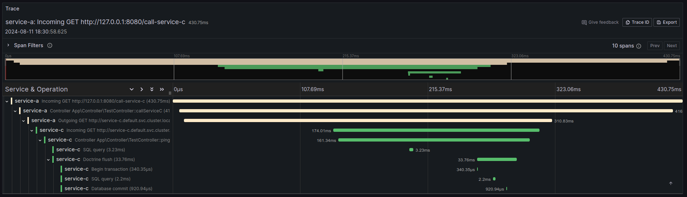

### Symfony OpenTelemetry integration

Traces for Symfony framework. Works without any special php extensions.



### Supported Symfony versions

Right now this bundle supports Symfony 6.4 and 7.1.
If you need support of other versions, create an issue.  

### List of packages

The set of packages which integrate OpenTelemetry tracing capabilities into different symfony components.

| Package                                | Repository                                                | Description                                                                                                              |
|----------------------------------------|-----------------------------------------------------------|--------------------------------------------------------------------------------------------------------------------------|
| zim32/symfony-tracing-core             | https://github.com/zim32/symfony-tracing-core             | Core bundle. Provides tracers and integrates with symfony http kernel to propagate trace context and to create root span |
| zim32/symfony-tracing-orm              | https://github.com/zim32/symfony-tracing-orm              | OpenTelemetry tracing for Doctrine                                                                                       |
| zim32/symfony-tracing-messenger        | https://github.com/zim32/symfony-tracing-messenger        | OpenTelemetry tracing for Messenger. Propagates trace context through message stamps                                     |
| zim32/symfony-tracing-event-dispatcher | https://github.com/zim32/symfony-tracing-event-dispatcher | OpenTelemetry tracing for Symfony event dispatcher component                                                             |
| zim32/symfony-tracing-http-client      | https://github.com/zim32/symfony-tracing-http-client      | OpenTelemetry tracing for Symfony HTTP client component                                                                  |
| zim32/symfony-tracing-psr18            | https://github.com/zim32/symfony-tracing-psr18            | OpenTelemetry tracing for Symfony PSR18 http client wrapper                                                              |


### Getting started

Installation:

````
composer require zim32/symfony-tracing-core
````

Add resource detector service to set set appropriate resource attributes:

````yaml
# config/services.yaml
services:
    # ...

    Zim\SymfonyTracingCoreBundle\SymfonyResourceDetector:
        arguments:
            $attributes:
                service.name: 'your-service-name'
                service.version: '0.0.1'
````

By default, this bundle will export spans using monolog. 
To configure real exporter, change exporter in `config/packages/tracing.yaml` file.

### Trace other components

Pick what you need and install appropriate packages. 
F.e. to trace Symfony http client (with context propagation) just install:

````
composer require zim32/symfony-tracing-http-client
````

To trace Symfony Messenger just install:

````
composer require zim32/symfony-tracing-messenger
````

See created files in `config/packages/tracing_*` for available options. 
